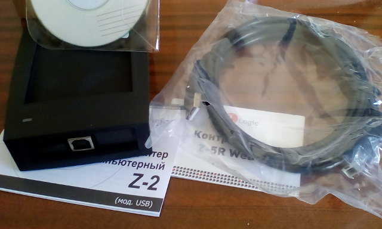

Кардридер IronLogic Z-2 USB:
```
$ dmesg
[134226.883092] usb 3-1: new full-speed USB device number 3 using uhci_hcd
[134227.072115] usb 3-1: New USB device found, idVendor=0403, idProduct=1234
[134227.072120] usb 3-1: New USB device strings: Mfr=1, Product=2, SerialNumber=3
[134227.072124] usb 3-1: Product: USB IronLogic RFID Adapter
[134227.072126] usb 3-1: Manufacturer: ILogic
[134227.072129] usb 3-1: SerialNumber: IL03E3BH
```



Определяется, как USB девайс. Если карточку поднести, то пикает и
мигает зелёненьким, как положено, но как получить с этого устройства
информацию на Linux пока совершенно непонятно.

Надо понять вообще, что это за устройство. USB девайсы обычно зашивают
всё необходимую информацию, которую можно опросить через `lsusb`:
```
$ sudo lsusb -v -d 0403:

Bus 003 Device 002: ID 0403:1234 Future Technology Devices International, Ltd IronLogic RFID Adapter [Z-2 USB]
Device Descriptor:
  bLength                18
  bDescriptorType         1
  bcdUSB               2.00
  bDeviceClass            0 
  bDeviceSubClass         0 
  bDeviceProtocol         0 
  bMaxPacketSize0         8
  idVendor           0x0403 Future Technology Devices International, Ltd
  idProduct          0x1234 IronLogic RFID Adapter [Z-2 USB]
  bcdDevice            6.00
  iManufacturer           1 ILogic
  iProduct                2 USB IronLogic RFID Adapter
  iSerial                 3 IL03E3BH
  bNumConfigurations      1
  Configuration Descriptor:
    bLength                 9
    bDescriptorType         2
    wTotalLength           32
    bNumInterfaces          1
    bConfigurationValue     1
    iConfiguration          0 
    bmAttributes         0xa0
      (Bus Powered)
      Remote Wakeup
    MaxPower              132mA
    Interface Descriptor:
      bLength                 9
      bDescriptorType         4
      bInterfaceNumber        0
      bAlternateSetting       0
      bNumEndpoints           2
      bInterfaceClass       255 Vendor Specific Class
      bInterfaceSubClass    255 Vendor Specific Subclass
      bInterfaceProtocol    255 Vendor Specific Protocol
      iInterface              2 USB IronLogic RFID Adapter
      Endpoint Descriptor:
        bLength                 7
        bDescriptorType         5
        bEndpointAddress     0x81  EP 1 IN
        bmAttributes            2
          Transfer Type            Bulk
          Synch Type               None
          Usage Type               Data
        wMaxPacketSize     0x0040  1x 64 bytes
        bInterval               0
      Endpoint Descriptor:
        bLength                 7
        bDescriptorType         5
        bEndpointAddress     0x02  EP 2 OUT
        bmAttributes            2
          Transfer Type            Bulk
          Synch Type               None
          Usage Type               Data
        wMaxPacketSize     0x0040  1x 64 bytes
        bInterval               0
can't get device qualifier: Resource temporarily unavailable
can't get debug descriptor: Resource temporarily unavailable
Device Status:     0x0000
  (Bus Powered)
```

С помощью Google по ключевым параметрам можно понять, что
устройство поддерживает USB 2.0 (bcdUSB), версия самого
устройства 6.0 (bcdDevice), и относится оно к
[неопределённому классу](https://en.wikipedia.org/wiki/USB#Device_classes)
(bDeviceClass). По идее класс должен быть или 02h или 0Bh,
но видно не судьба. Впрочем, спецификация говорит, что при
00h смотреть надо на Interface Descriptor.


Ссылки:

 - https://wiki.debian.org/HowToIdentifyADevice/USB
 - http://www.beyondlogic.org/usbnutshell/usb5.shtml
